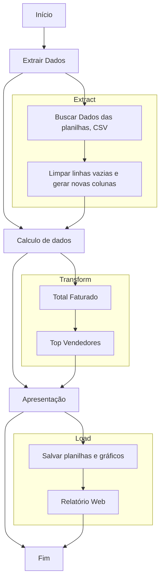

# Documentação do Desafio

## Visão Geral

Este projeto é uma aplicação Flask que processa dados de vendas de várias lojas, gera gráficos e relatórios, e apresenta os resultados em uma interface web. A aplicação carrega dados de arquivos Excel e CSV, calcula métricas de vendas, gera gráficos de faturamento e cria relatórios em Excel.

## Fluxo de Processamento de Dados

Este documento descreve o fluxo de processamento de dados do projeto, desde a extração dos dados até a apresentação dos resultados.



## Estrutura do Projeto

- `App/`
  - `data/`: Contém os arquivos de dados (Excel e CSV).
  - `scripts/`: Contém os scripts de processamento de dados e geração de gráficos.
  - `static/`: Contém os arquivos estáticos, como imagens dos gráficos gerados.
  - `templates/`: Contém os templates HTML para a interface web.
  - `powerbi/`: Contém o script para gerar relatórios em Excel.
  - `main.py`: Arquivo principal da aplicação Flask.
  - `requirements.txt`: Arquivo com as dependências do projeto.

## Dependências

As dependências do projeto estão listadas no arquivo `requirements.txt`:

```plaintext
Flask=3.0.3
pandas=2.2.3
matplotlib=3.9.2
seaborn=0.13.2
openpyxl=3.1.5
```

## Scripts 

`load_data.py`: Este script carrega e processa os dados das lojas

##### Funções

- `separar_prc_qtd`:Separa a coluna "Preço Unitário - Qtde" em duas colunas: "Preço Unitário" e "Quantidade"
- `calcular_valor_venda(df)`:Calcula o valor de venda multiplicado pelo preço unitário e quantidade
- `ordenar_data(df)`:Ordena os dados pelo mês da venda
- `load_data()`: Carrega os dados das lojas e produtos, realiza a limpeza e transformação dos dados, e retorna os DataFrames processados.

``calcular_metricas.py`:Este script calcula métricas de vendas.

##### Funções
- `calcular_total_faturado(loja1, loja2, loja3)`:Calcula o total faturado por cada loja.
- `calcular_top_vendedores(loja1, loja2, loja3)`:Calcula os principais vendedores por loja.

`gerar_grafico_faturamento_categoria.py`:Este script gera gráficos de faturamento mensal e por categoria de produto

##### Funções

- `gerar_grafico_faturamento_categoria(df)`: Gera e salva grafico de faturamento mensal e por categoria de produto. 

`generate_powerbi_report.py`:Este script gera relatórios em Excel com os dados de faturamento e principais vendedores.

##### Funções

- `generate_powerbi_report(df, total_faturado, total_faturado_loja1, total_faturado_loja2, total_faturado_loja3, top_vendedores_loja1, top_vendedores_loja2, top_vendedores_loja3, soma_total_faturado)`:Cria e salva relatórios em Excel com os dados de faturamento e principais vendedores.

##### Aplicação Flask

`main.py`

Este é o arquivo principal da aplicação Flask. Ele carrega os dados, calcula as métricas, gera gráficos e relatórios, e define a rota para a interface web.

- `\`:Rota principal que renderiza o template `index.html` com os dados de vendas e métricas calculadas.

## Executando aplicação

1. Crie um ambiente virtual em python na raiz do desafio
```
python -m venv venv
```
* Fique atento a sua versão do python, caso seja o python3

2. Excute o ambiente virtual 
- `source venv/bin/activate`: Linux
- `.\venv\Scripts\activate`: Windows
2. Instale as dependências listadas em `requirements.txt`:
```
pip install -r requirements.txt
```
2. Execute a aplicação Flask
```
python main.py
```
ou
````
python3 main.py
````
3. Acesse a aplicação no navegador em `http://127.0.0.1:5000/`.

## Conclusão

Este desafio fornece uma solução completa para o processamento, análise e visualização de dados de vendas de várias lojas. Ele utiliza a biblioteca Flask para criar uma interface web, pandas para manipulação de dados, matplotlib e seaborn para geração de gráficos, e openpyxl para criação de relatórios em Excel. 